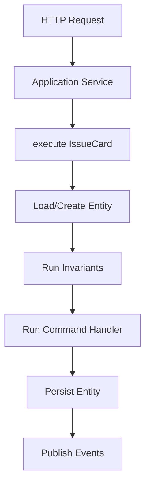
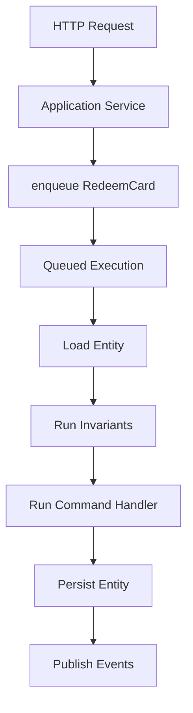
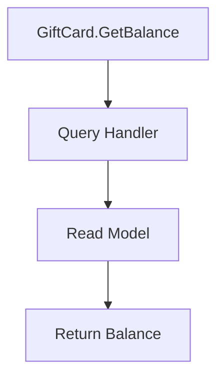
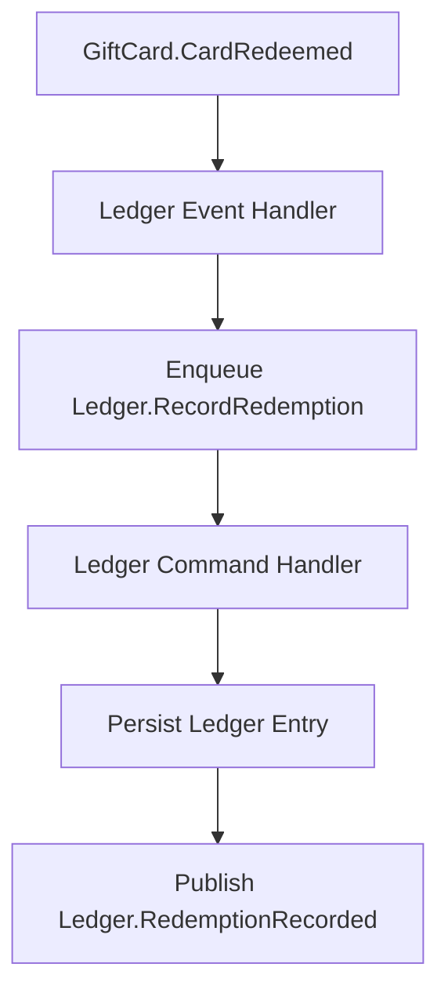

# Preliminary Design Document: Framework Concepts

## Purpose and Status

This document is a **brainstorming and sanity-check artifact** that explores how the vision in `docs/VISION.md` could translate into framework concepts. It is intentionally **non-binding** and should be read as a starting reference rather than a committed design. The language uses future tense for readability, but nothing here is finalized.

The goal is a **candidate application-facing model** for discussion, focused on public concepts and lifecycle guarantees instead of implementation details. The framing is DDD-inspired and centered on explicit domain language.

## Alignment with Vision

The document takes the vision’s principles as guardrails:

* domain language is encoded directly in code
* boundaries and invariants remain explicit
* temporal decoupling is a first-class concern
* traceability stays visible across time

## Concepts and Definition APIs

The framework concept set is organized around explicit definition APIs that preserve language, boundaries, and constraints. Concepts are declared independently to keep intent clear.

* `defineApplicationService`: edge orchestration and timing
* `defineCommand`: intent to change state
* `defineCommandHandler`: domain decision point for commands
* `defineEntity`: domain state and identity (use `parent` for child entities)
* `defineInvariants`: business rules around state transitions
* `defineEvent`: change that occurred
* `defineEventHandler`: reaction to domain events
* `defineQuery`: question about the system
* `defineQueryHandler`: read model access
* `defineDomainService`: multi-read domain logic with constraints

Schemas will be co-located with the concept definition. Examples use `Zod` for readability; the framework will accept any `Standard Schema`-compatible validator under the hood.

These APIs are illustrative and may change as ADRs refine naming, validation, and handler structure.

These decisions should stay aligned with DDD principles and the vision’s focus on explicit language, boundaries, and invariant preservation.

## User Stories (Exploratory)

These user stories are thought experiments used to sanity-check the concepts and terminology. The examples map the stories into possible APIs. They are not commitments; they exist to test coherence, terminology, and lifecycle assumptions. The emphasis is on how the concepts could compose, not on final syntax or naming.

Each story describes a business intent (command), how the framework coordinates execution (handlers + invariants), and which facts are emitted (events). Application services sit at the edge to orchestrate application concerns and execution, while domain handlers orchestrate the business logic and raise domain events.

### Shared `GiftCard` Model

The `GiftCard` context anchors the entity state and baseline invariants used across the stories, so each workflow starts from the same domain model. We define it first because every command and query needs a shared source of truth.

The sections below reuse this model to explain how commands, handlers, and queries orchestrate business logic.

#### Entity

The entity schema defines the persisted state and how the framework identifies instances. We use `defineEntity` so the framework can load state, apply invariants, and persist changes consistently. Commands use `target` to locate the entity to load, while `id` defines the identity the framework uses when persisting, rehydrating, or comparing aggregates.

```ts
export const GiftCard = defineEntity({
	schema: z.object({
		id: z.string().min(1),
		remainingValue: z.number().int().nonnegative()
	}),
	id: function (s) {
		return s.id
	}
})

export type GiftCardState = z.infer<typeof GiftCard.schema>
```

#### Invariants (Combined Pre + Post)

Input-level constraints (e.g., `amount` is positive) are handled by schemas. Invariants focus on **state-based correctness** and are first-class business concepts, so the framework can prevent invalid state transitions even if handlers change.

```ts
// Universally applicable invariants, as opposed to command-specific rules
export const giftCardRules = defineInvariants({
	entity: GiftCard,
	after: [
		{
			code: 'GIFT_CARD_NEGATIVE_BALANCE',
			message: 'Gift card remaining value must never be negative',
			check: function (_cmd, ctx) {
				return ctx.state.remainingValue >= 0
			}
		}
	]
})
```

### Issue a Gift Card (Strongly Consistent Use Case)

A single command execution boundary yields a consistent entity write and event publication.

The example below uses `IssueCard` and `CardIssued` to show how the framework validates input, applies invariants, mutates state, and emits a fact in one execution boundary.

This story starts at the edge with `issueCardService`, which accepts input and calls `execute` on `IssueCard`. The framework validates the command schema, loads or creates the `GiftCard` entity, runs invariants, and executes the `issueCardHandler`. The handler applies the state change and raises `CardIssued`, which the framework publishes as the resulting fact.



#### Command

The command captures intent and validates input so the framework can route and validate the request consistently. The `cardId` is supplied by the application service when issuing a new card.

```ts
import { z } from 'zod'

export const IssueCard = defineCommand({
	schema: z.object({
		cardId: z.string().min(1),
		amount: z.number().int().positive()
	}),
	target: function (c) {
		return c.cardId
	},
})
```

#### Application Services (Edge Concerns Only)

Application services translate transport concerns into domain inputs and pick execution timing. They also generate any new identifiers before executing or enqueuing commands. We use `defineApplicationService` to keep edge logic separate from domain decisions.

Application services *should* not:

* handle business logic
* raise domain events
* manage persistence

They *should*:

* handle application concerns (auth, mapping, response shaping)
* orchestrate command processing timeline: execute (synchronous) vs. enqueuing (asynchronous)

```ts
import crypto from 'node:crypto'

export const issueCardService = defineApplicationService({
	input: z.object({
		amount: z.number().int().positive()
	}),
	handle: async function (input, ctx) {
		await ctx.auth.requireUser()

		const cardId = crypto.randomUUID()

		await ctx.commands.execute(IssueCard, { cardId, amount: input.amount })

		return { cardId }
	}
})
```

#### Command Handler

Handlers apply domain decisions and emit events. The creation policy (always create, never create, or create if missing) is defined alongside the handler so entity instantiation rules stay in the domain layer.

```ts
export const issueCardHandler = defineCommandHandler({
	entity: GiftCard,
	command: IssueCard,
	creation: 'always',
	handle: function (cmd, ctx) {
		ctx.state.id = cmd.cardId
		ctx.state.remainingValue = cmd.amount

		ctx.raise(CardIssued, {
			cardId: cmd.cardId,
			amount: cmd.amount
		})
	}
})
```

#### Event

The event records the outcome in the same domain language so downstream consumers can react without re-running logic.

```ts
export const CardIssued = defineEvent({
	schema: z.object({
		cardId: z.string().min(1),
		amount: z.number().int().positive()
	})
})
```


### Redeem a Gift Card (Eventually Consistent Use Case)

The command is accepted now and converges later through queued execution. The framework runs invariants and handlers when the command is dequeued, not at request time.

The example below uses `RedeemCard` and `CardRedeemed` to show how the framework queues work, runs invariants on execution, and publishes the resulting event.

This story begins with `redeemCardService`, which enqueues `RedeemCard`. The framework stores the work and later executes it by loading the `GiftCard`, enforcing `redeemCardRules`, running `redeemCardHandler`, and publishing `CardRedeemed`. The delay makes the workflow eventually consistent while keeping domain rules intact.



#### Command

The command expresses intent to redeem so validation and routing remain explicit.

```ts
import { z } from 'zod'

export const RedeemCard = defineCommand({
	schema: z.object({
		cardId: z.string().min(1),
		transactionId: z.string().min(1),
		amount: z.number().int().positive()
	}),
	target: function (c) {
		return c.cardId
	}
})
```

#### Application Service

The application service accepts the request, applies edge concerns, and enqueues the command for later execution. This makes the eventual consistency boundary explicit in the API.

```ts
export const redeemCardService = defineApplicationService({
	input: RedeemCard.schema,
	handle: async function (input, ctx) {
		await ctx.auth.requireUser()

		await ctx.commands.enqueue(RedeemCard, input)

		return { accepted: true }
	}
})
```

#### Invariants (Command-Specific)

Invariants ensure business rules run before and after state changes, even when execution is deferred; this is how the framework enforces correctness during eventual consistency.

```ts
// Command-specific invariants
export const redeemCardRules = defineInvariants({
	entity: GiftCard,
	command: RedeemCard,
	before: [
		{
			code: 'GIFT_CARD_INSUFFICIENT_BALANCE',
			message: 'Cannot redeem more than the remaining gift card value',
			check: function (cmd, ctx) {
				return cmd.amount <= ctx.state.remainingValue
			}
		}
	],
	after: [
		{
			code: 'GIFT_CARD_NEGATIVE_BALANCE',
			message: 'Gift card remaining value must never be negative',
			check: function (_cmd, ctx) {
				return ctx.state.remainingValue >= 0
			}
		}
	]
})
```

#### Command Handler

Handlers apply domain decisions and emit events. The creation policy (always create, never create, or create if missing) is defined alongside the handler so entity instantiation rules stay in the domain layer.

```ts
export const redeemCardHandler = defineCommandHandler({
	entity: GiftCard,
	command: RedeemCard,
	creation: 'never',
	handle: function (cmd, ctx) {
		// Preconditions already ran; postconditions will run before commit.
		ctx.state.remainingValue -= cmd.amount

		ctx.raise(CardRedeemed, {
			cardId: ctx.state.id,
			transactionId: cmd.transactionId,
			amount: cmd.amount
		})
	}
})
```

#### Event

The event confirms the redemption has been recorded so downstream consumers can react without re-running logic.

```ts
export const CardRedeemed = defineEvent({
	schema: z.object({
		cardId: z.string().min(1),
		transactionId: z.string().min(1),
		amount: z.number().int().positive()
	})
})
```

### Check Gift Card Balance (Read Use Case)

The `QueryHandler` reads from a read model. We use `defineQuery` and `defineQueryHandler` so reads stay explicit and separate from command workflows.

The query story shows how read models stay isolated from write-side invariants and handlers.

This story uses `GetGiftCardBalance` as a read-only request. The framework validates the query schema, routes it to `getGiftCardBalance`, and returns the read model without touching domain state.



#### Query

The query describes the read intent and the expected result shape, which lets the framework validate inputs and responses.

```ts
import { z } from 'zod'

export const GetGiftCardBalance = defineQuery({
	schema: z.object({
		cardId: z.string().min(1)
	}),
	result: z.object({
		cardId: z.string().min(1),
		remainingValue: z.number()
	})
})
```

#### Query Handler (Application Layer)

The handler reads from the read model and returns a domain-shaped response without mutating state.

```ts
export const getGiftCardBalance = defineQueryHandler({
	query: GetGiftCardBalance,
	handle: async function (q, ctx) {
		const row = await ctx.read.giftCards.getById(q.cardId)
		if (!row) return null
		return { cardId: row.id, remainingValue: row.remainingValue }
	}
})
```

### Record Redemption in Ledger (Cross-Boundary Async Flow)

The `Ledger` context reacts to `GiftCard.CardRedeemed`, translating the upstream fact into a local command and event while preserving boundary language. This shows how the framework keeps cross-boundary workflows decoupled through events.

This story starts when the `Ledger` event handler receives `GiftCard.CardRedeemed`. The handler enqueues `RecordRedemption`, the framework executes it against `LedgerEntry`, and `recordRedemptionHandler` raises `RedemptionRecorded`. The event keeps the workflow moving across boundaries without direct calls.



#### Event Handler (Reacts to Fact → Enqueues Local Command)

The handler translates the inbound fact into a local command, keeping the boundary decoupled while still propagating the workflow.

```ts
import crypto from 'node:crypto'

export const onCardRedeemed = defineEventHandler({
	on: CardRedeemed,
	handle: async function (evt, ctx) {
		await ctx.commands.enqueue(RecordRedemption, {
			ledgerEntryId: crypto.randomUUID(),
			cardId: evt.cardId,
			transactionId: evt.transactionId,
			amount: evt.amount
		})
	}
})
```

#### Command

The command represents `Ledger` intent so routing and validation remain explicit in this boundary.

```ts
import { z } from 'zod'

export const RecordRedemption = defineCommand({
	schema: z.object({
		ledgerEntryId: z.string().min(1),
		cardId: z.string().min(1),
		transactionId: z.string().min(1),
		amount: z.number().int().positive()
	}),
	target: function (c) {
		return c.ledgerEntryId
	},
})
```

#### Entity and Command Handler

The entity models the ledger entry state, while the handler applies the command to produce the event, keeping business decisions inside the boundary. If the ledger needs line items, child entities can be modeled alongside the parent schema. A `defineEntity` with a `parent` field is treated as a child entity for routing purposes. Events raised from child-aware handlers carry the root aggregate identity in context for publishing and tracing.

```ts
import { z } from 'zod'

const LedgerLineSchema = z.object({
	lineId: z.string().min(1),
	accountId: z.string().min(1),
	amount: z.number().int(),
	type: z.enum(['debit', 'credit'])
})

export const LedgerEntry = defineEntity({
	schema: z.object({
		id: z.string().min(1),
		cardId: z.string().min(1),
		transactionId: z.string().min(1),
		amount: z.number().int().positive(),
		lines: z.array(LedgerLineSchema)
	}),
	id: function (s) {
		return s.id
	}
})

export const LedgerLine = defineEntity({
	parent: LedgerEntry,
	schema: LedgerLineSchema,
	id: function (l) {
		return l.lineId
	}
})

export const recordRedemptionHandler = defineCommandHandler({
	entity: LedgerEntry,
	command: RecordRedemption,
	creation: 'always',
	handle: function (cmd, ctx) {
		ctx.state.id = cmd.ledgerEntryId
		ctx.state.cardId = cmd.cardId
		ctx.state.transactionId = cmd.transactionId
		ctx.state.amount = cmd.amount

		ctx.raise(RedemptionRecorded, {
			ledgerEntryId: cmd.ledgerEntryId,
			cardId: cmd.cardId,
			transactionId: cmd.transactionId,
			amount: cmd.amount
		})
	}
})
```

#### Event

The event captures the recorded fact for downstream consumers and keeps the `Ledger` boundary in control of its language.

```ts
export const RedemptionRecorded = defineEvent({
	schema: z.object({
		ledgerEntryId: z.string().min(1),
		cardId: z.string().min(1),
		transactionId: z.string().min(1),
		amount: z.number().int().positive()
	})
})
```

## Lifecycle and Deterministic Rules (Exploratory)

### Command Execution Lifecycle

When executing or processing a command with a `target`:

1. Validate input via schema.
2. Resolve target entity id + creation policy (from the handler).
3. Load/create entity instance (tracked).
4. Run invariants:

   * entity-level `before`, then command-level `before`.
5. Run handler in a staged execution context (events buffered).
6. Run invariants:

   * command-level `after`, then entity-level `after`.
7. Persist entity + publish buffered events (only if all checks pass).

Creation policies include `always`, `never`, and `if_missing`.

### Temporal Decoupling

Application services choose timing:

* `execute(command, input)` runs the command now.
* `enqueue(command, input)` accepts now and runs later.

Both are async; “run now” does not mean “sync.”

### Execution Context and Transactions

Execution runs inside request-scoped context backed by `AsyncLocalStorage`. The framework uses this context to manage tracing, transactions, and persistence lifecycles consistently:

* start a transaction when command execution begins
* commit when all invariants pass and persistence succeeds
* roll back on errors or failed invariants
* expose request-scoped utilities (tracing, auth, ids) without manual plumbing

Testing utilities can create a scoped context to make handlers deterministic without requiring explicit `ctx` wiring.

### One Entity Write per Command Execution

A command handler is bound to a single entity instance. Cross-entity workflows are expressed through events, event handlers, and additional commands over time.

Any future allowance for multi-entity writes would require a deliberate ADR.

## Traceability and Observability (Exploratory)

Traceability is shown here as a framework-owned default and may be scoped differently in ADRs. Application code does not manage tracing; the framework handles propagation, spans, and export end to end.

### Tracing Architecture

The framework owns trace propagation and span creation across the execution pipeline:

* **Edge adapters** extract and inject W3C trace context for HTTP, queues, and event handlers.
* **Execution pipeline** wraps application services, command execution, event handling, and query handling with spans.
* **Message correlation** attaches trace identifiers to commands/events/queries to preserve causality across boundaries.
* **Export layer** forwards traces to OTLP/OpenTelemetry destinations via a pluggable exporter.

### Standards

* **W3C Trace Context** for propagation (`traceparent`, `tracestate`)
* **OpenTelemetry** for instrumentation APIs and semantic conventions
* **OTLP** as the primary export protocol for traces/metrics/logs

### Framework Responsibilities

The framework will:

* extract and propagate W3C trace context across HTTP and message transports
* create spans for key lifecycle phases (application services, command execution, event handling)
* export telemetry via OTLP (configurable)

Application code will not manually construct tracing metadata.

## Boundaries

* Each boundary owns its language and models.
* Boundaries communicate via commands/events, not direct calls into another boundary’s domain.
* Event handlers live in the receiving boundary and translate inbound facts into local actions.

### Note: Domain Events vs Integration Events (Open Question)

We may introduce a distinction between:

* **Domain events**: internal facts in a boundary’s ubiquitous language
* **Integration events**: stable, cross-boundary contracts with explicit versioning/compatibility expectations

If adopted, cross-boundary communication would prefer integration events, while domain events remain internal. This decision is intentionally deferred to ADRs.

## Future Concepts and Utilities

These ideas are adjacent to the current design and may become first-class concepts. Names and APIs are illustrative.

### Strategy Policies

Policies centralize strategy selection without scattering conditionals across handlers.

```ts
export const FraudAssessment = defineStrategy({ name: 'FraudAssessment' })

export const basicFraud = defineStrategyVariant(FraudAssessment, {
	name: 'basic',
	assess: async function () {
		return 'allow'
	}
})

export const fraudPolicy = defineStrategyPolicy({
	strategy: FraudAssessment,
	select: function (ctx) {
		return ctx.tenantId === 'enterprise' ? 'vendorX' : 'basic'
	}
})
```

### Repositories

Repositories provide explicit load/save access when a handler needs direct control.

```ts
export const redeemCardHandler = defineCommandHandler({
	command: RedeemCard,
	handle: async function (cmd, ctx) {
		const card = await ctx.repositories.load(GiftCard, cmd.cardId)
		card.remainingValue -= cmd.amount
		await ctx.repositories.save(GiftCard, card)
	}
})
```

### Async Context and Transactions

Async context makes request-scoped tracing and transactions available without threading `ctx` everywhere.

```ts
await withContext(ctx, async () => {
	await ctx.tx.begin()
	await ctx.commands.execute(IssueCard, input)
	await ctx.tx.commit()
})
```

## ADR Candidates / Open Questions

This document should feed ADRs for decisions that are still unsettled.

* Naming and introspection: exported identifier inference vs explicit names.
* Creation policy placement and semantics (handler-scoped `always`/`never`/`if_missing`).
* Entity state schemas: required vs optional and how they integrate with persistence.
* Integration events vs domain events for cross-context boundaries.
* Traceability defaults and which spans are mandatory vs configurable.

## Summary

This document summarizes candidate concepts and lifecycles to seed ADRs, focusing on:

* commands/events/queries as explicit domain language
* application services for edge concerns and timing decisions (`execute` vs `enqueue`)
* entity command handlers as the domain decision point
* first-class invariants (combined pre/post) enforced by the framework
* W3C/OpenTelemetry/OTLP traceability built-in, with framework-owned propagation and spans
* clear boundary communication patterns
* an open question on integration events for future ADRs
