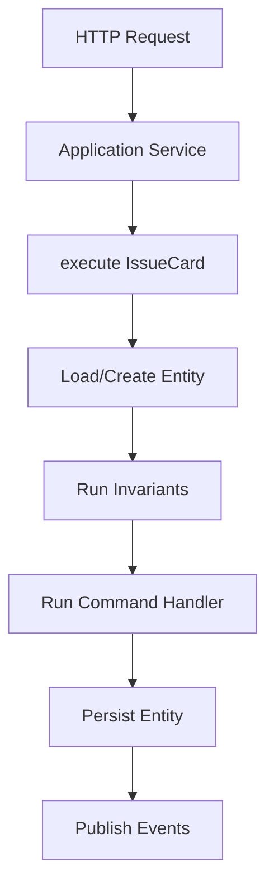
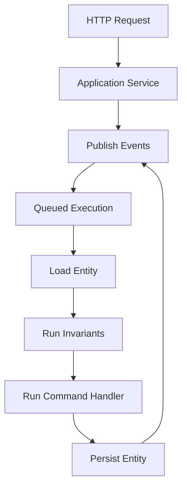
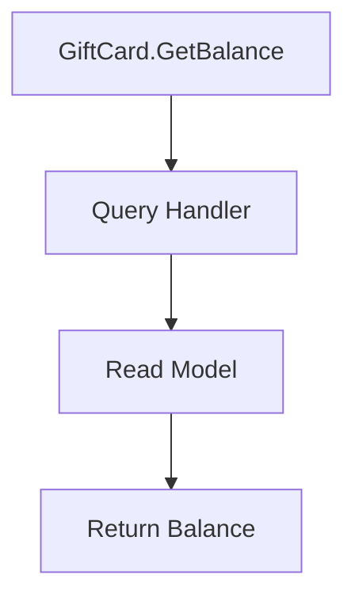
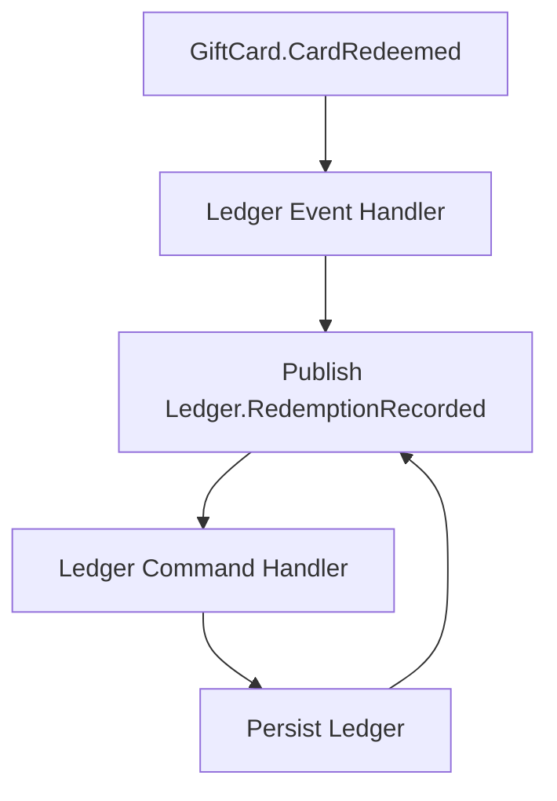

# User Stories (Exploratory)

These user stories are thought experiments used to sanity-check the concepts and terminology. The examples map the stories into possible APIs. They are not commitments; they exist to test coherence, terminology, and lifecycle assumptions. The emphasis is on how the concepts could compose, not on final syntax or naming.

Each story describes a business intent (command), how the framework coordinates execution (handlers + invariants), and which facts are emitted (events). Application services sit at the edge to orchestrate application concerns and execution, while domain handlers orchestrate the business logic and raise domain events. Execution context will be available implicitly via `useContext()`; handlers will receive `cmd` and `state` instead of an explicit `ctx` parameter.

## Shared `GiftCard` Model

The `GiftCard` context anchors the entity state and baseline invariants used across the stories, so each workflow starts from the same domain model. We define it first because every command and query needs a shared source of truth.

The sections below reuse this model to explain how commands, handlers, and queries orchestrate business logic.

### Entity

The entity schema defines the persisted state and how the framework identifies instances. We use `defineEntity` so the framework can load state, apply invariants, and persist changes consistently. Commands use `target` to locate the entity to load, while `id` defines the identity the framework uses when persisting, rehydrating, or comparing aggregates.

```ts
export const GiftCard = defineEntity()
  .schema(
    z.object({
      id: z.string().min(1),
      remainingValue: z.number().int().nonnegative()
    })
  )
  .id((state) => state.id)

export type GiftCardState = z.infer<typeof GiftCard.schema>
```

### Invariants

Input-level constraints (e.g., `amount` being positive) are handled by schemas. Invariants focus on **state-based correctness** and remain first-class business concepts, so the framework can prevent invalid state transitions after the handlers update the state.

```ts
// Universally applicable invariants, as opposed to command-specific rules
export const giftCardRules = defineInvariants()
  .entity(GiftCard)
  .check([
    {
      code: 'GIFT_CARD_NEGATIVE_BALANCE',
      message: 'Gift card remaining value must never be negative',
      check: (state) => state.remainingValue >= 0
    }
  ])
```

Invariants run at the beginning or end of the lifecycle based on `when`. If `when` targets a command, the invariants run before the command handler. If `when` targets an event, the invariants run after the event is raised. If `when` is omitted, the invariants default to the end of the command execution lifecycle. Command-specific invariants can be defined similarly:

```ts
// Command-specific invariants
export const redeemCardRules = defineInvariants()
  .entity(GiftCard)
  .when(RedeemCard)
  .check([
    {
      code: 'GIFT_CARD_INSUFFICIENT_BALANCE',
      message: 'Cannot redeem more than the remaining gift card value',
      check: (command, state) => command.amount <= state.remainingValue
    }
  ])

// Event-specific invariants
export const cardIssuedRules = defineInvariants()
  .entity(GiftCard)
  .when(CardIssued)
  .check([
    {
      code: 'GIFT_CARD_INITIAL_BALANCE_MISMATCH',
      message: 'Card issued amount must match the stored balance',
      check: (event, state) => state.remainingValue === event.amount
    }
  ])
```

## Issue a Gift Card (Strongly Consistent Use Case)

A single command execution boundary yields a consistent entity write and event publication.

The example below uses `IssueCard` and `CardIssued` to show how the framework validates input, applies invariants, mutates state, and emits a fact in one execution boundary.

This story starts at the edge with `issueCardService`, which accepts input and calls `issueCardHandler.execute`. The framework validates the command schema, loads or creates the `GiftCard` entity, runs invariants, and executes the `issueCardHandler`. The handler initializes the card balance, and the framework persists the updated state before publishing `CardIssued` as the resulting fact.



### Command

The command captures intent and validates input so the framework can route and validate the request consistently. The `cardId` will be supplied by the application service when issuing a new card.

```ts
import { z } from 'zod'

export const IssueCard = defineCommand()
  .schema(
    z.object({
      cardId: z.string().min(1),
      amount: z.number().int().positive()
    })
  )
  .target((command) => command.cardId)
```

### Application Services (Edge Concerns Only)

Application services translate transport concerns into domain inputs and pick execution timing. They will also generate any new identifiers before executing or publishing commands, depending on whether the workflow runs locally or through messaging infrastructure. We use `defineApplicationService` to keep edge logic separate from domain decisions. Authentication helpers like `requireUser()` are optional conveniences, not core framework concepts.

Application services *should* not:

* handle business logic
* raise domain events
* manage persistence

They *should*:

* handle application concerns (auth, mapping, response shaping)
* orchestrate command processing timeline: execute (immediate) vs. publish (messaging/distributed)

```ts
import crypto from 'node:crypto'

export const issueCardService = defineApplicationService()
  .input(
    z.object({
      amount: z.number().int().positive()
    })
  )
  .handle(async (input) => {
    await requireUser()

    const cardId = crypto.randomUUID()

    await issueCardHandler.execute({ cardId, amount: input.amount })

    return { cardId }
  })
```

### Command Handler

Handlers apply domain decisions and emit events. The creation policy (always create, never create, or create if missing) will be defined alongside the handler so entity instantiation rules stay in the domain layer.

```ts
export const issueCardHandler = defineCommandHandler()
  .entity(GiftCard)
  .command(IssueCard)
  .creation('always')
  .handle((command, state) => {
    state.id = command.cardId
    state.remainingValue = command.amount

    raise(CardIssued, {
      cardId: command.cardId,
      amount: command.amount
    })
  })
```

### Event

The event records the outcome in the same domain language so downstream consumers can react without re-running logic.

```ts
export const CardIssued = defineEvent()
  .schema(
    z.object({
      cardId: z.string().min(1),
      amount: z.number().int().positive()
    })
  )
```

### Creation Policy Variant

Creation policies allow commands to create a new entity when appropriate without relaxing invariants; keeping them on the handler makes the lifecycle rule explicit in the domain layer.

```ts
export const issueOrRechargeCardHandler = defineCommandHandler()
  .entity(GiftCard)
  .command(IssueOrRechargeCard)
  .creation('if_missing')
  .handle((command, state) => {
    state.id = command.cardId
    state.remainingValue += command.amount

    raise(CardIssued, {
      cardId: command.cardId,
      amount: command.amount
    })
  })
```

## Redeem a Gift Card (Eventually Consistent Use Case)

The command will be accepted now and will converge later through queued execution. The framework will run invariants and handlers when the command is dequeued, not at request time.

The example below uses `RedeemCard` and `CardRedeemed` to show how the framework queues work, runs invariants on execution, and publishes the resulting event.

This story begins with `redeemCardService`, which calls `redeemCardHandler.publish` to messaging (future behavior). The framework will store the work and later execute it by loading the `GiftCard`, enforcing `redeemCardRules`, running `redeemCardHandler`, and publishing `CardRedeemed`. The handler subtracts the redeemed amount from the remaining balance and emits the redemption event. The delay makes the workflow eventually consistent because the command is accepted immediately but applied later, allowing asynchronous processing and retries while preserving domain rules.



### Command

The command expresses intent to redeem so validation and routing remain explicit.

```ts
import { z } from 'zod'

export const RedeemCard = defineCommand()
  .schema(
    z.object({
      cardId: z.string().min(1),
      transactionId: z.string().min(1),
      amount: z.number().int().positive()
    })
  )
  .target((command) => command.cardId)
```

### Application Service

The application service accepts the request, applies edge concerns, and publishes the command to messaging for later execution. This makes the eventual consistency boundary explicit in the API.

```ts
export const redeemCardService = defineApplicationService()
  .input(RedeemCard.schema)
  .handle(async (input) => {
    await requireUser()

    await redeemCardHandler.publish(input) // future transport adapter

    return { accepted: true }
  })
```

### Command Handler

Handlers apply domain decisions and emit events. The creation policy (always create, never create, or create if missing) will be defined alongside the handler so entity instantiation rules stay in the domain layer.

```ts
export const redeemCardHandler = defineCommandHandler()
  .entity(GiftCard)
  .command(RedeemCard)
  .creation('never')
  .handle((command, state) => {
    // Preconditions already ran; postconditions will run before commit.
    state.remainingValue -= command.amount

    raise(CardRedeemed, {
      cardId: state.id,
      transactionId: command.transactionId,
      amount: command.amount
    })
  })
```

### Event

The event confirms the redemption has been recorded so downstream consumers can react without re-running logic.

```ts
export const CardRedeemed = defineEvent()
  .schema(
    z.object({
      cardId: z.string().min(1),
      transactionId: z.string().min(1),
      amount: z.number().int().positive()
    })
  )
```

## Check Gift Card Balance (Read Use Case)

The `QueryHandler` reads from a read model. We use `defineQuery` and `defineQueryHandler` so reads stay explicit and separate from command workflows.

The query story shows how read models stay isolated from write-side invariants and handlers.

This story uses `GetGiftCardBalance` as a read-only request. The framework will validate the query schema, route it to `getGiftCardBalance`, and return the read model without touching domain state.



### Query

The query describes the read intent and the expected result shape, which lets the framework validate inputs and responses.

```ts
import { z } from 'zod'

export const GetGiftCardBalance = defineQuery()
  .schema(
    z.object({
      cardId: z.string().min(1)
    })
  )
  .result(
    z.object({
      cardId: z.string().min(1),
      remainingValue: z.number()
    })
  )
```

### Query Handler (Application Layer)

The handler reads from the read model and returns a domain-shaped response without mutating state.

```ts
export const getGiftCardBalance = defineQueryHandler()
  .query(GetGiftCardBalance)
  .handle(async (query) => {
    const giftCardReadModel = useRepository(GiftCardReadModel)
    const row = await giftCardReadModel.getById(query.cardId)
    if (!row) return null
    return { cardId: row.id, remainingValue: row.remainingValue }
  })
```

## Record Redemption in Ledger (Cross-Boundary Async Flow)

The `Ledger` context reacts to `GiftCard.CardRedeemed`, translating the upstream fact into a local command and event while preserving boundary language. This shows how the framework keeps cross-boundary workflows decoupled through events.

This story starts when the `Ledger` event handler receives `GiftCard.CardRedeemed`. The handler publishes `RecordRedemption` to messaging, the framework executes it against `Ledger`, and `recordRedemptionHandler` raises `RedemptionRecorded`. The ledger records the transaction for reporting and reconciliation, keeping the workflow moving across boundaries without direct calls.




### Event Handler (Reacts to Fact → Enqueues Local Command)

The handler translates the inbound fact into a local command, keeping the boundary decoupled while still propagating the workflow.

```ts
import crypto from 'node:crypto'

export const onCardRedeemed = defineEventHandler()
  .on(CardRedeemed)
  .handle(async (event) => {
    await recordRedemptionHandler.publish({
      ledgerId: crypto.randomUUID(),
      cardId: event.cardId,
      transactionId: event.transactionId,
      amount: event.amount
    }) // future transport adapter
  })
```

### Command

The command represents `Ledger` intent so routing and validation remain explicit in this boundary.

```ts
import { z } from 'zod'

export const RecordRedemption = defineCommand()
  .schema(
    z.object({
      ledgerId: z.string().min(1),
      cardId: z.string().min(1),
      transactionId: z.string().min(1),
      amount: z.number().int().positive()
    })
  )
  .target((command) => command.ledgerId)
```

### Entity and Command Handler

The entity models the ledger state, while the handler applies the command to produce the event, keeping business decisions inside the boundary. If the ledger needs line items, entries can be modeled as child entities under the root. A `defineEntity` with a `parent` field will be treated as a child entity for routing purposes. Events raised from child-aware handlers carry the root aggregate identity in context for publishing and tracing.

```ts
import { z } from 'zod'

const LedgerEntrySchema = z.object({
  entryId: z.string().min(1),
  cardId: z.string().min(1),
  transactionId: z.string().min(1),
  amount: z.number().int().positive()
})

export const Ledger = defineEntity()
  .schema(
    z.object({
      id: z.string().min(1),
      entries: z.array(LedgerEntrySchema)
    })
  )
  .id((state) => state.id)

export const LedgerEntry = defineEntity()
  .parent(Ledger)
  .schema(LedgerEntrySchema)
  .id((entry) => entry.entryId)

export const recordRedemptionHandler = defineCommandHandler()
  .entity(Ledger)
  .command(RecordRedemption)
  .creation('always')
  .handle((command, state) => {
    state.id = command.ledgerId
    state.entries.push({
      entryId: command.transactionId,
      cardId: command.cardId,
      transactionId: command.transactionId,
      amount: command.amount
    })

    raise(RedemptionRecorded, {
      ledgerId: command.ledgerId,
      cardId: command.cardId,
      transactionId: command.transactionId,
      amount: command.amount
    })
  })
```

### Event

The event captures the recorded fact for downstream consumers and keeps the `Ledger` boundary in control of its language.

```ts
export const RedemptionRecorded = defineEvent()
  .schema(
    z.object({
      ledgerId: z.string().min(1),
      cardId: z.string().min(1),
      transactionId: z.string().min(1),
      amount: z.number().int().positive()
    })
  )
```
