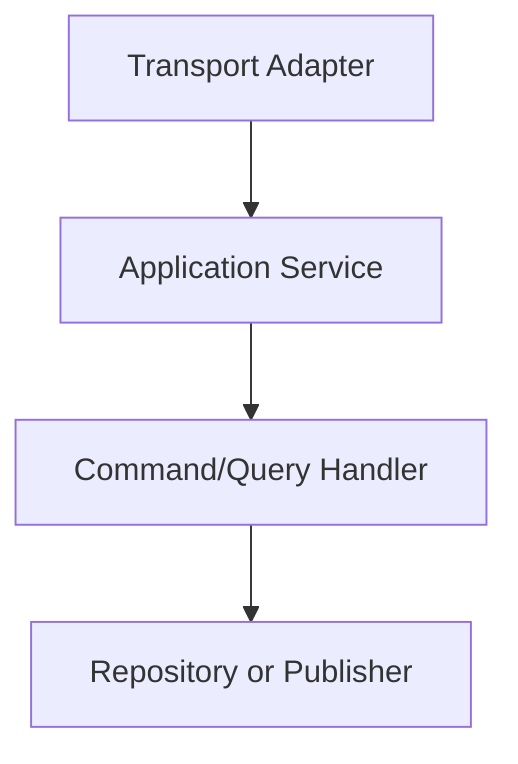

# Preliminary Design Document

## Purpose and Status

This document is a **brainstorming and sanity-check artifact** that explores how the vision in `docs/vision.md` could translate into framework concepts. It is intentionally **non-binding** and should be read as a starting reference rather than a committed design. The language uses future tense for readability, but nothing here is finalized.

The goal is a **candidate application-facing model** for discussion, focused on public concepts and lifecycle guarantees instead of implementation details. The framing is DDD-inspired and centered on explicit domain language.

## Primer

This repository contains the preliminary design documents for a domain-first framework that keeps business language explicit and decouples application orchestration from domain logic.

The framework follows a Clean Architecture style with a Node-friendly take:

- **Application Services**: input validation, auth, ALS context initialization, orchestration, response shaping.
- **Domain Layer**: entities, invariants, command/query handlers, domain services.
- **Frameworks & Drivers**: Express/tRPC/oRPC runtimes, AWS SDK, DB drivers, OTEL SDK.
- **Interface Adapters**: transport adapters (HTTP/RPC/queues/CLI), repositories, observability, providers.

### Flow of Control

## Sections

- [`docs/pdd/001-introduction.md`](001-introduction.md)
- [`docs/pdd/002-user-stories.md`](002-user-stories.md)
- [`docs/pdd/003-core-concepts.md`](003-core-concepts.md)
- [`docs/pdd/004-runtime-model.md`](004-runtime-model.md)
- [`docs/pdd/005-application-services.md`](005-application-services.md)
- [`docs/pdd/006-repositories.md`](006-repositories.md)
- [`docs/pdd/007-infrastructure.md`](007-infrastructure.md)
- [`docs/pdd/008-observability.md`](008-observability.md)
- [`docs/pdd/009-ai-integrations.md`](009-ai-integrations.md)
- [`docs/pdd/010-open-questions.md`](010-open-questions.md)
