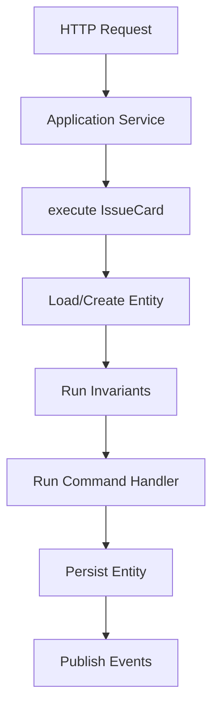
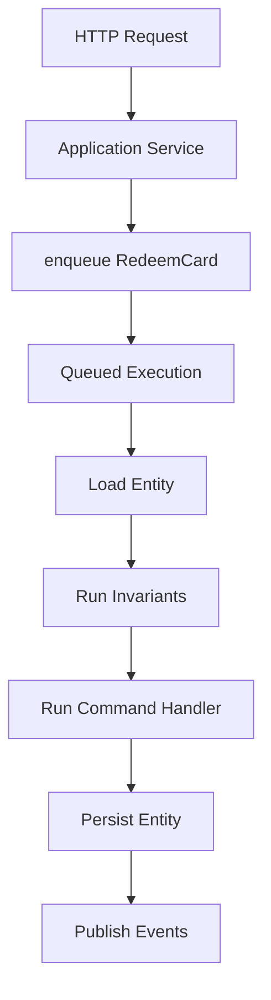
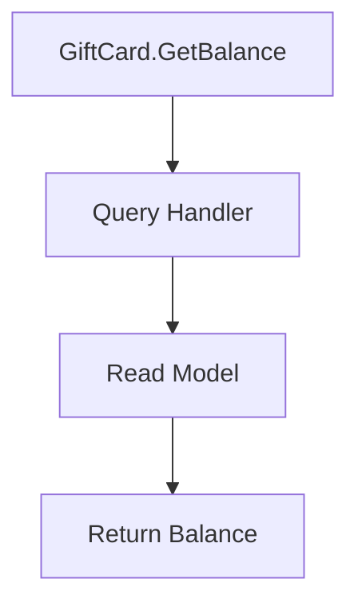
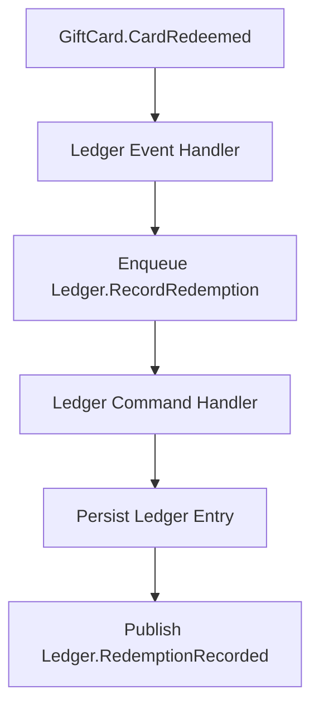

# User Stories (Exploratory)

These user stories are thought experiments used to sanity-check the concepts and terminology. The examples map the stories into possible APIs. They are not commitments; they exist to test coherence, terminology, and lifecycle assumptions. The emphasis is on how the concepts could compose, not on final syntax or naming.

Each story describes a business intent (command), how the framework coordinates execution (handlers + invariants), and which facts are emitted (events). Application services sit at the edge to orchestrate application concerns and execution, while domain handlers orchestrate the business logic and raise domain events. Execution context is available implicitly via `useContext()`; handlers receive `cmd` and `state` instead of an explicit `ctx` parameter.

## Shared `GiftCard` Model

The `GiftCard` context anchors the entity state and baseline invariants used across the stories, so each workflow starts from the same domain model. We define it first because every command and query needs a shared source of truth.

The sections below reuse this model to explain how commands, handlers, and queries orchestrate business logic.

### Entity

The entity schema defines the persisted state and how the framework identifies instances. We use `defineEntity` so the framework can load state, apply invariants, and persist changes consistently. Commands use `target` to locate the entity to load, while `id` defines the identity the framework uses when persisting, rehydrating, or comparing aggregates.

```ts
export const GiftCard = defineEntity({
	schema: z.object({
		id: z.string().min(1),
		remainingValue: z.number().int().nonnegative()
	}),
	id: function (s) {
		return s.id
	}
})

export type GiftCardState = z.infer<typeof GiftCard.schema>
```

### Invariants (Combined Pre + Post)

Input-level constraints (e.g., `amount` is positive) are handled by schemas. Invariants focus on **state-based correctness** and are first-class business concepts, so the framework can prevent invalid state transitions even if handlers change.

```ts
// Universally applicable invariants, as opposed to command-specific rules
export const giftCardRules = defineInvariants({
	entity: GiftCard,
	after: [
		{
			code: 'GIFT_CARD_NEGATIVE_BALANCE',
			message: 'Gift card remaining value must never be negative',
			check: function (_cmd, state) {
				return state.remainingValue >= 0
			}
		}
	]
})
```

## Issue a Gift Card (Strongly Consistent Use Case)

A single command execution boundary yields a consistent entity write and event publication.

The example below uses `IssueCard` and `CardIssued` to show how the framework validates input, applies invariants, mutates state, and emits a fact in one execution boundary.

This story starts at the edge with `issueCardService`, which accepts input and calls `execute` on `IssueCard`. The framework validates the command schema, loads or creates the `GiftCard` entity, runs invariants, and executes the `issueCardHandler`. The handler applies the state change and raises `CardIssued`, which the framework publishes as the resulting fact.



### Command

The command captures intent and validates input so the framework can route and validate the request consistently. The `cardId` is supplied by the application service when issuing a new card.

```ts
import { z } from 'zod'

export const IssueCard = defineCommand({
	schema: z.object({
		cardId: z.string().min(1),
		amount: z.number().int().positive()
	}),
	target: function (c) {
		return c.cardId
	},
})
```

### Application Services (Edge Concerns Only)

Application services translate transport concerns into domain inputs and pick execution timing. They also generate any new identifiers before executing or enqueuing commands. We use `defineApplicationService` to keep edge logic separate from domain decisions. Authentication helpers like `requireUser()` are optional conveniences, not core framework concepts.

Application services *should* not:

* handle business logic
* raise domain events
* manage persistence

They *should*:

* handle application concerns (auth, mapping, response shaping)
* orchestrate command processing timeline: execute (synchronous) vs. enqueuing (asynchronous)

```ts
import crypto from 'node:crypto'

export const issueCardService = defineApplicationService({
	input: z.object({
		amount: z.number().int().positive()
	}),
	handle: async function (input) {
		const ctx = useContext()
		await ctx.auth.requireUser()

		const cardId = crypto.randomUUID()

		await ctx.commands.execute(IssueCard, { cardId, amount: input.amount })

		return { cardId }
	}
})
```

### Command Handler

Handlers apply domain decisions and emit events. The creation policy (always create, never create, or create if missing) is defined alongside the handler so entity instantiation rules stay in the domain layer.

```ts
export const issueCardHandler = defineCommandHandler({
	entity: GiftCard,
	command: IssueCard,
	creation: 'always',
	handle: function (cmd, state) {
		const ctx = useContext()
		state.id = cmd.cardId
		state.remainingValue = cmd.amount

		ctx.raise(CardIssued, {
			cardId: cmd.cardId,
			amount: cmd.amount
		})
	}
})
```

### Event

The event records the outcome in the same domain language so downstream consumers can react without re-running logic.

```ts
export const CardIssued = defineEvent({
	schema: z.object({
		cardId: z.string().min(1),
		amount: z.number().int().positive()
	})
})
```

### Creation Policy Variant

Creation policies allow commands to create a new entity when appropriate without relaxing invariants; keeping them on the handler makes the lifecycle rule explicit in the domain layer.

```ts
export const issueOrRechargeCardHandler = defineCommandHandler({
	entity: GiftCard,
	command: IssueOrRechargeCard,
	creation: 'if_missing',
	handle: function (cmd, state) {
		const ctx = useContext()
		state.id = cmd.cardId
		state.remainingValue = cmd.amount

		ctx.raise(CardIssued, {
			cardId: cmd.cardId,
			amount: cmd.amount
		})
	}
})
```

## Redeem a Gift Card (Eventually Consistent Use Case)

The command is accepted now and converges later through queued execution. The framework runs invariants and handlers when the command is dequeued, not at request time.

The example below uses `RedeemCard` and `CardRedeemed` to show how the framework queues work, runs invariants on execution, and publishes the resulting event.

This story begins with `redeemCardService`, which enqueues `RedeemCard`. The framework stores the work and later executes it by loading the `GiftCard`, enforcing `redeemCardRules`, running `redeemCardHandler`, and publishing `CardRedeemed`. The delay makes the workflow eventually consistent while keeping domain rules intact.



### Command

The command expresses intent to redeem so validation and routing remain explicit.

```ts
import { z } from 'zod'

export const RedeemCard = defineCommand({
	schema: z.object({
		cardId: z.string().min(1),
		transactionId: z.string().min(1),
		amount: z.number().int().positive()
	}),
	target: function (c) {
		return c.cardId
	}
})
```

### Application Service

The application service accepts the request, applies edge concerns, and enqueues the command for later execution. This makes the eventual consistency boundary explicit in the API.

```ts
export const redeemCardService = defineApplicationService({
	input: RedeemCard.schema,
	handle: async function (input) {
		const ctx = useContext()
		await ctx.auth.requireUser()

		await ctx.commands.enqueue(RedeemCard, input)

		return { accepted: true }
	}
})
```

### Invariants (Command-Specific)

Invariants ensure business rules run before and after state changes, even when execution is deferred; this is how the framework enforces correctness during eventual consistency.

```ts
// Command-specific invariants
export const redeemCardRules = defineInvariants({
	entity: GiftCard,
	command: RedeemCard,
	before: [
		{
			code: 'GIFT_CARD_INSUFFICIENT_BALANCE',
			message: 'Cannot redeem more than the remaining gift card value',
			check: function (cmd, state) {
				return cmd.amount <= state.remainingValue
			}
		}
	],
	after: [
		{
			code: 'GIFT_CARD_NEGATIVE_BALANCE',
			message: 'Gift card remaining value must never be negative',
			check: function (_cmd, state) {
				return state.remainingValue >= 0
			}
		}
	]
})
```

### Command Handler

Handlers apply domain decisions and emit events. The creation policy (always create, never create, or create if missing) is defined alongside the handler so entity instantiation rules stay in the domain layer.

```ts
export const redeemCardHandler = defineCommandHandler({
	entity: GiftCard,
	command: RedeemCard,
	creation: 'never',
	handle: function (cmd, state) {
		const ctx = useContext()
		// Preconditions already ran; postconditions will run before commit.
		state.remainingValue -= cmd.amount

		ctx.raise(CardRedeemed, {
			cardId: state.id,
			transactionId: cmd.transactionId,
			amount: cmd.amount
		})
	}
})
```

### Event

The event confirms the redemption has been recorded so downstream consumers can react without re-running logic.

```ts
export const CardRedeemed = defineEvent({
	schema: z.object({
		cardId: z.string().min(1),
		transactionId: z.string().min(1),
		amount: z.number().int().positive()
	})
})
```

## Check Gift Card Balance (Read Use Case)

The `QueryHandler` reads from a read model. We use `defineQuery` and `defineQueryHandler` so reads stay explicit and separate from command workflows.

The query story shows how read models stay isolated from write-side invariants and handlers.

This story uses `GetGiftCardBalance` as a read-only request. The framework validates the query schema, routes it to `getGiftCardBalance`, and returns the read model without touching domain state.



### Query

The query describes the read intent and the expected result shape, which lets the framework validate inputs and responses.

```ts
import { z } from 'zod'

export const GetGiftCardBalance = defineQuery({
	schema: z.object({
		cardId: z.string().min(1)
	}),
	result: z.object({
		cardId: z.string().min(1),
		remainingValue: z.number()
	})
})
```

### Query Handler (Application Layer)

The handler reads from the read model and returns a domain-shaped response without mutating state.

```ts
export const getGiftCardBalance = defineQueryHandler({
	query: GetGiftCardBalance,
	handle: async function (q) {
		const ctx = useContext()
		const row = await ctx.read.giftCards.getById(q.cardId)
		if (!row) return null
		return { cardId: row.id, remainingValue: row.remainingValue }
	}
})
```

## Record Redemption in Ledger (Cross-Boundary Async Flow)

The `Ledger` context reacts to `GiftCard.CardRedeemed`, translating the upstream fact into a local command and event while preserving boundary language. This shows how the framework keeps cross-boundary workflows decoupled through events.

This story starts when the `Ledger` event handler receives `GiftCard.CardRedeemed`. The handler enqueues `RecordRedemption`, the framework executes it against `LedgerEntry`, and `recordRedemptionHandler` raises `RedemptionRecorded`. The event keeps the workflow moving across boundaries without direct calls.



### Event Handler (Reacts to Fact → Enqueues Local Command)

The handler translates the inbound fact into a local command, keeping the boundary decoupled while still propagating the workflow.

```ts
import crypto from 'node:crypto'

export const onCardRedeemed = defineEventHandler({
	on: CardRedeemed,
	handle: async function (evt) {
		const ctx = useContext()
		await ctx.commands.enqueue(RecordRedemption, {
			ledgerEntryId: crypto.randomUUID(),
			cardId: evt.cardId,
			transactionId: evt.transactionId,
			amount: evt.amount
		})
	}
})
```

### Command

The command represents `Ledger` intent so routing and validation remain explicit in this boundary.

```ts
import { z } from 'zod'

export const RecordRedemption = defineCommand({
	schema: z.object({
		ledgerEntryId: z.string().min(1),
		cardId: z.string().min(1),
		transactionId: z.string().min(1),
		amount: z.number().int().positive()
	}),
	target: function (c) {
		return c.ledgerEntryId
	},
})
```

### Entity and Command Handler

The entity models the ledger entry state, while the handler applies the command to produce the event, keeping business decisions inside the boundary. If the ledger needs line items, child entities can be modeled alongside the parent schema. A `defineEntity` with a `parent` field is treated as a child entity for routing purposes. Events raised from child-aware handlers carry the root aggregate identity in context for publishing and tracing.

```ts
import { z } from 'zod'

const LedgerLineSchema = z.object({
	lineId: z.string().min(1),
	accountId: z.string().min(1),
	amount: z.number().int(),
	type: z.enum(['debit', 'credit'])
})

export const LedgerEntry = defineEntity({
	schema: z.object({
		id: z.string().min(1),
		cardId: z.string().min(1),
		transactionId: z.string().min(1),
		amount: z.number().int().positive(),
		lines: z.array(LedgerLineSchema)
	}),
	id: function (s) {
		return s.id
	}
})

export const LedgerLine = defineEntity({
	parent: LedgerEntry,
	schema: LedgerLineSchema,
	id: function (l) {
		return l.lineId
	}
})

export const recordRedemptionHandler = defineCommandHandler({
	entity: LedgerEntry,
	command: RecordRedemption,
	creation: 'always',
	handle: function (cmd, state) {
		const ctx = useContext()
		state.id = cmd.ledgerEntryId
		state.cardId = cmd.cardId
		state.transactionId = cmd.transactionId
		state.amount = cmd.amount

		ctx.raise(RedemptionRecorded, {
			ledgerEntryId: cmd.ledgerEntryId,
			cardId: cmd.cardId,
			transactionId: cmd.transactionId,
			amount: cmd.amount
		})
	}
})
```

### Event

The event captures the recorded fact for downstream consumers and keeps the `Ledger` boundary in control of its language.

```ts
export const RedemptionRecorded = defineEvent({
	schema: z.object({
		ledgerEntryId: z.string().min(1),
		cardId: z.string().min(1),
		transactionId: z.string().min(1),
		amount: z.number().int().positive()
	})
})
```
